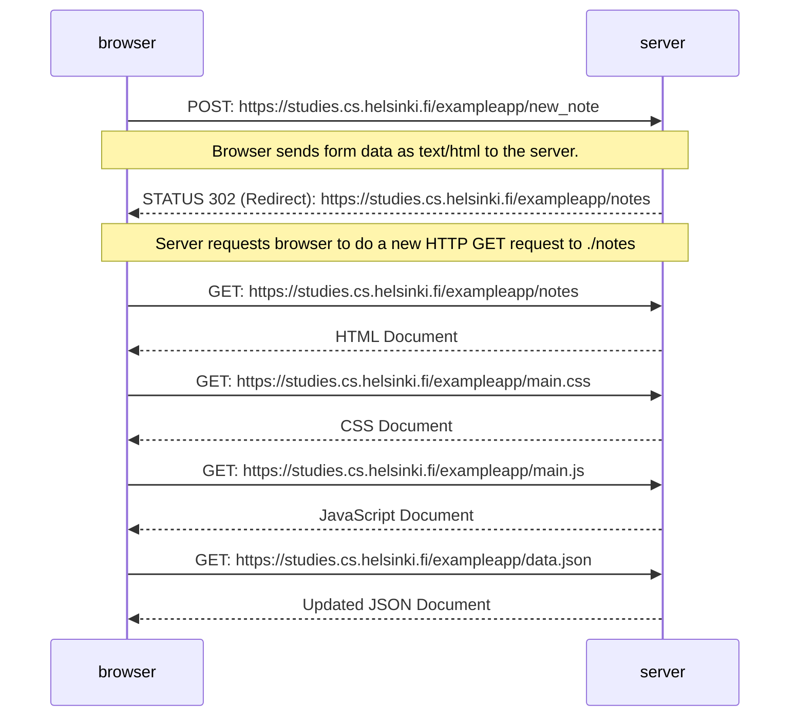

```mermaid

sequenceDiagram
    participant browser
    participant server

    browser->>server: POST: https://studies.cs.helsinki.fi/exampleapp/new_note 
    Note over browser,server : Browser sends form data as text/html to the server.

    server-->>browser: STATUS 302 (Redirect): https://studies.cs.helsinki.fi/exampleapp/notes 
    Note over browser,server: Server requests browser to do a new HTTP GET request to ./notes

    browser->>server: GET: https://studies.cs.helsinki.fi/exampleapp/notes 
    server-->>browser: HTML Document 

    browser->>server: GET: https://studies.cs.helsinki.fi/exampleapp/main.css 
    server-->>browser: CSS Document

    browser->>server: GET: https://studies.cs.helsinki.fi/exampleapp/main.js 
    server-->>browser: JavaScript Document  

    browser->>server: GET: https://studies.cs.helsinki.fi/exampleapp/data.json 
    server-->>browser: Updated JSON Document 
    
    

```