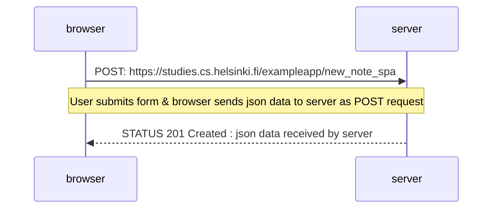

```mermaid

sequenceDiagram
    participant browser
    participant server

    browser->>server: POST: https://studies.cs.helsinki.fi/exampleapp/new_note_spa 
    Note over browser,server: User submits form & browser sends json data to server as POST request

    server-->>browser: STATUS 201 Created : json data received by server 
 

    
    
    

```